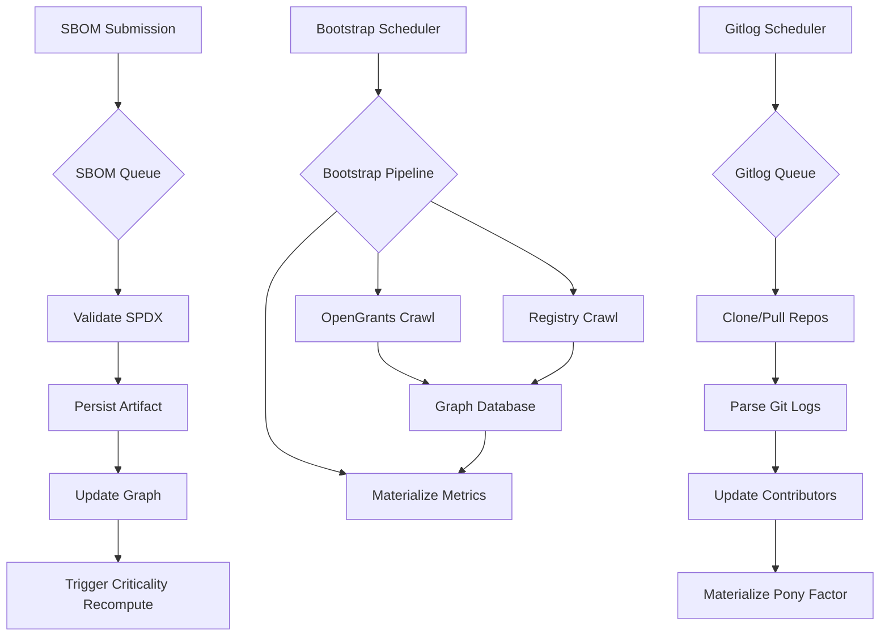

# Ingestion

## Overview

The ingestion layer collects and normalizes data from three parallel streams that feed the dependency
graph and contributor statistics:

1. **SBOM submissions** — explicit dependency declarations from project repositories via GitHub
   Actions
2. **Reference graph bootstrapping** — automated crawling of package registries and OpenGrants to
   build baseline coverage
3. **Git contributor logs** — commit history analysis for pony factor calculation

All three streams are operational and run through dedicated processing workflows. Ingestion writes
occur at **repo resolution**, with `Project` vertices sourced primarily from OpenGrants and `Repo`
vertices created or updated by SBOM submissions and registry crawls.



The system handles incremental updates (SBOM submissions and targeted git log refreshes) alongside
periodic full refreshes (weekly bootstrap). All pipelines are idempotent when source data has not
changed, and validate inputs before persisting changes.

## SBOM Ingestion

SBOM (Software Bill of Materials) ingestion provides the verification layer for dependency
declarations. Stellar ecosystem builders submit SPDX 2.3 documents via a GitHub Action, which are
processed through a dedicated queue workflow.

**Current status**: Operational with
[hourly batch processing](https://github.com/SCF-Public-Goods-Maintenance/pg-atlas-backend/actions/workflows/sbom-queue.yml).

**How it works**:

- Teams add a
  [lightweight GitHub Action](https://github.com/SCF-Public-Goods-Maintenance/pg-atlas-sbom-action)
  to their workflows. The action fetches the repo's SPDX 2.3 dependency graph from the
  [GitHub Dependency Graph API](https://docs.github.com/en/rest/dependency-graph/sboms) and submits
  it to the PG Atlas ingestion endpoint, authenticated via a GitHub OIDC token. Supports both public
  and private repos.
- Roadmap item: allow non-GitHub SBOM submissions which are signed with a project key for provenance
  (deferred for v0).

**Authentication**:

The action requests a short-lived GitHub OIDC token (RS256-signed JWT issued by GitHub's OIDC
provider) with the PG Atlas API URL as the audience, and sends it in the `Authorization: Bearer`
header of the submission request. No secrets need to be configured in the calling repository — the
only caller-side requirement is `id-token: write` in the workflow's `permissions` block.

The API verifies the token by:

1. Fetching GitHub's public JWKS from `https://token.actions.githubusercontent.com/.well-known/jwks`.
1. Verifying the RS256 signature and standard claims (`iss`, `exp`, `aud`).
1. Extracting the `repository` claim (`owner/repo`) to establish which repo submitted the SBOM, and
   recording the `actor` (triggering user) for audit purposes.

Both GitHub-hosted and self-hosted runners are supported. The OIDC token in both cases is signed by
GitHub's OIDC provider and contains a `runner_environment` claim (`github-hosted` or `self-hosted`).

**Trust model**: The OIDC token cryptographically proves the _identity_ of the submitting repo — it
guarantees that the submission originated from a workflow running in the context of `owner/repo`,
authorized by a GitHub user with write access. It does **not** independently verify the _content_ of
the submitted SBOM: a workflow author controls the workflow YAML and could in principle modify the
payload before submission. The principal mitigations are: (1) the reference graph cross-check flags
declared dependencies that diverge from the inferred graph; (2) all submissions are logged with the
`repository` and `actor` claims, making falsification an attributable act; (3) community review and
the public dataset create social accountability.

**Processing**: The
[SBOM queue workflow](https://github.com/SCF-Public-Goods-Maintenance/pg-atlas-backend/blob/main/.github/workflows/sbom-queue.yml)
runs hourly to process new submissions:

- Validate SPDX 2.3 format and schema
- Extract dependencies with support for nested SPDX package relationships (added to handle complex
  dependency structures)
- Persist the canonical SPDX artifact to Filebase S3 with IPFS CID recorded in the database for
  auditability
- Map dependencies to `Repo` (within-ecosystem) or `ExternalRepo` (outside) vertices using
  `canonical_id` normalization
- Upsert the submitting `Repo` vertex and create/update `depends_on` edges with
  `confidence = verified-sbom`
- Apply repo-scoped queueing lock to prevent concurrent processing of the same repository
- **Automatically trigger criticality score recomputation** for the updated dependency graph

The workflow uses semantic deduplication to avoid reprocessing identical SBOMs, even if submitted
multiple times

**Incentives & Enforcement (v0)**:

- Soft: Bonus points in PG scoring for early/complete submissions.
- Planned: Tie to SCF Build testnet tranche release (preferred over mainnet to capture dependencies
  early).

**Example workflow**:

```yaml
jobs:
  sbom:
    runs-on: ubuntu-latest
    permissions:
      contents: read # for GitHub Dependency Graph API
      id-token: write # for OIDC authentication to PG Atlas
    steps:
      - uses: SCF-Public-Goods-Maintenance/pg-atlas-sbom-action@<full-commit-hash>
        with:
          # Optional: override API endpoint (defaults to https://api.pgatlas.xyz)
          api-url: https://api.pgatlas.xyz
          # Optional: override submission path (defaults to /ingest/sbom)
          submission-path: /ingest/sbom
          # Optional: test without submitting (defaults to false)
          dry-run: false
```

The `api-url` input defaults to `https://api.pgatlas.xyz` and typically does not need to be
overridden except for testing against staging environments. The `dry-run` option allows testing the
SBOM fetch and OIDC token generation without actually submitting to the API. The calling repository
must have the GitHub dependency graph enabled.

**Roadmap items**:

- Flag conflicts with reference graph (e.g. large discrepancies) for manual review.

## Reference Graph Bootstrapping

The bootstrap pipeline builds baseline graph coverage by crawling public package registries and
OpenGrants data. This addresses the cold-start problem and provides a reference graph for validating
SBOM submissions.

**Current status**: Operational with
[weekly automated runs](https://github.com/SCF-Public-Goods-Maintenance/pg-atlas-backend/actions/workflows/bootstrap.yml).

**Data sources**:

- [OpenGrants](https://opengrants.daostar.org/system/scf) — primary source for `Project` vertices and
  their metadata (name, status, organization URL).
- GitHub API — repository enumeration, release/tag discovery
- [deps.dev](https://deps.dev/) gRPC API — cross-ecosystem dependency resolution (PyPI, npm, Cargo,
  Go, Maven, NuGet, RubyGems)
- Package registries — download counts and (best-effort) dependents from npm, crates.io, PyPI,
  pub.dev, and Packagist.

**Pipeline topology**:

The bootstrap workflow orchestrates four job stages with strategic parallelization:

1. **OpenGrants crawl** (`opengrants` queue) — Fetch all SCF projects from OpenGrants API, enrich
   each with GitHub repository metadata (stars, forks) and deps.dev package discovery, then crawl
   individual repositories to detect published packages and fetch release histories
2. **deps.dev dependency resolution** (`package-deps` queue) — For packages in deps.dev-supported
   ecosystems (PyPI, npm, Cargo, Maven, Go, RubyGems, NuGet), enumerate direct dependencies and build
   the within-ecosystem dependency graph
3. **Registry crawl** (`registry-crawl` queue) — For packages in ecosystems not fully covered by
   deps.dev (Dart/pub.dev, PHP/Packagist), collect download counts and adoption signals directly from
   package registries
4. **Metrics materialization** — Compute criticality scores and adoption scores for the updated graph

The workflow produces a
[job summary](https://github.com/SCF-Public-Goods-Maintenance/pg-atlas-backend/actions/workflows/bootstrap.yml)
with statistics on nodes processed, edges created, and metrics computed.

**OpenGrants crawl details**:

- `sync_opengrants` fetches all SCF grant pools and applications from the OpenGrants API, creating
  `ScfProject` objects with metadata (project ID, display name, GitHub URL from `io.scf.code` field,
  activity status, category)
- A manual `project-git-mapping.yml` supplements projects lacking an `io.scf.code` field (early
  rounds)
- For each project, `process_project` queries the GitHub API for repository metadata (stars, forks)
  and calls deps.dev's `get_project_batch` to fetch project-level metadata, then `populate_packages`
  to discover which packages are published from the repository
- `crawl_github_repo` processes each discovered repository, fetching release histories from deps.dev
  for known packages or falling back to manifest detection for uncovered ecosystems, then queues
  downstream dependency and registry crawl tasks
- Activity status is populated from SCF Impact Survey data when available; projects without survey
  responses default to `non-responsive` (see
  [Activity Status Update Logic](storage.md#activity-status-update-logic))
- Pre-survey data uses tranche completion as a proxy: incomplete → `in-dev`, complete → `live`

**Registry crawlers**:

Five package ecosystem crawlers are currently operational, collecting adoption signals:

- **npm** — JavaScript/TypeScript packages
- **crates.io** — Rust packages
- **PyPI** — Python packages
- **pub.dev** — Dart/Flutter packages
- **Packagist** — PHP packages

Each crawler fetches the latest 30-day download counts for packages that are published from source
repositories. This data is stored in `repo_metadata` as `adoption_downloads_by_purl`, materialized as
the repo's total download count, and used for project-level adoption score computation.

Some crawlers support the fetching of a package's dependent packages. Most package registries make a
dependents list available through their web UI, but lack this functionality in their API.

Coverage is proportional to PURL-linked registry packages — projects without published packages in
these registries will not have download count data and inferred dependents.

## Git Contributor Logs

Git log parsing extracts commit history to compute pony factor (contributor concentration risk) and
identify active contributors. This pipeline uses dormancy-based scheduling to prioritize repositories
that haven't been refreshed recently.

**Current status**: Operational with
[periodic automated runs](https://github.com/SCF-Public-Goods-Maintenance/pg-atlas-backend/actions/workflows/gitlog-queue.yml)
(every three days).

**Process**:

- The scheduler queues repositories based on dormancy — repositories with recent commits _or_ stale
  commit data (no git log refresh in the last N days) are prioritized
- For each repository, the system clones or pulls the latest commits.
- Parses commit logs to extract contributor email addresses (hashed for privacy) and commit counts
  over a rolling time window (typically 12-24 months)
- Filters out bot accounts using heuristics (e.g., `[bot]` suffix, common CI/CD email patterns like
  `dependabot@users.noreply.github.com`)
- Creates or updates `Contributor` vertices and `contributed_to` edges with commit counts, first/last
  commit dates
- Computes and materializes pony factor (minimum contributors responsible for ≥50% of commits) at
  both repo and project levels
- Updates `Repo.latest_commit_date` to feed activity status triangulation (see
  [Activity Status Update Logic](storage.md#activity-status-update-logic))

The dormancy-based approach minimizes redundant processing for repositories that change infrequently
while ensuring active repositories stay current.

## Automatic Metric Updates

Ingestion events trigger cascading metric recomputation to keep scores current:

- **SBOM submission** → Criticality score recomputation (queued via Procrastinate after graph update)
- **Bootstrap completion** → Full graph criticality and adoption score materialization
- **Git log processing** → Pony factor recomputation for updated repositories

This event-driven approach ensures that scores reflect the latest graph state without requiring
manual intervention. The
[bootstrap workflow summary](https://github.com/SCF-Public-Goods-Maintenance/pg-atlas-backend/actions/workflows/bootstrap.yml)
provides real-time visibility into metric computation performance.
