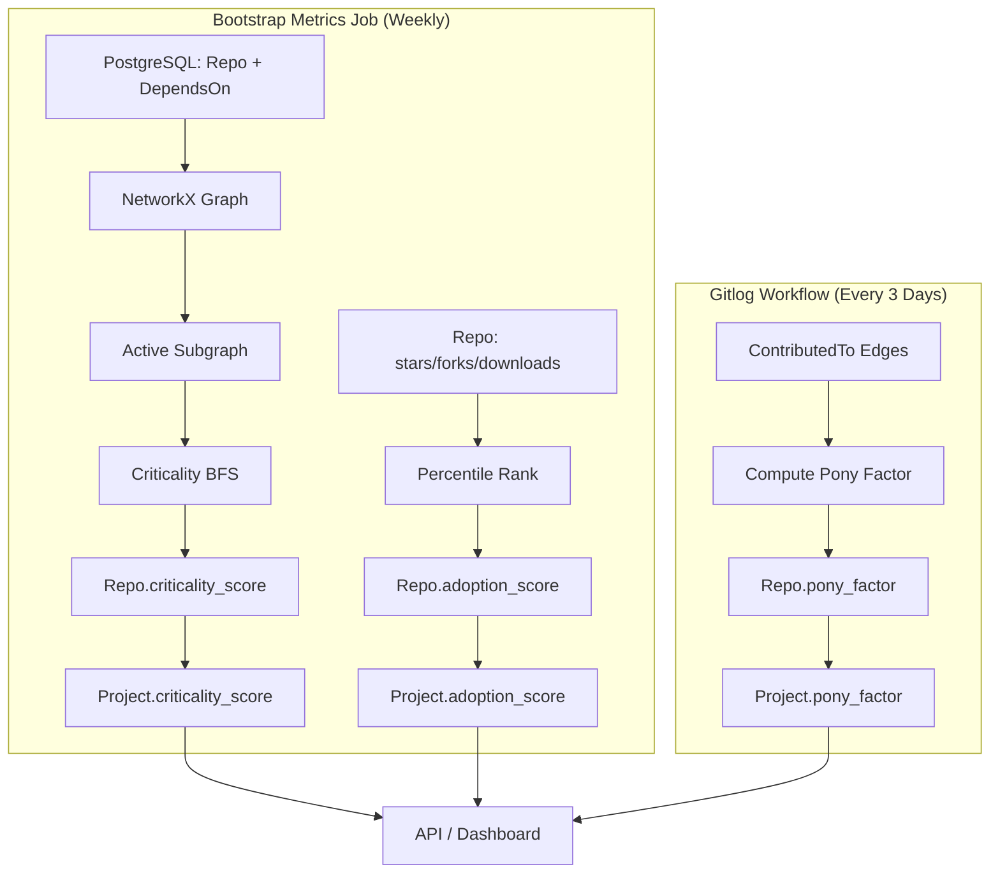
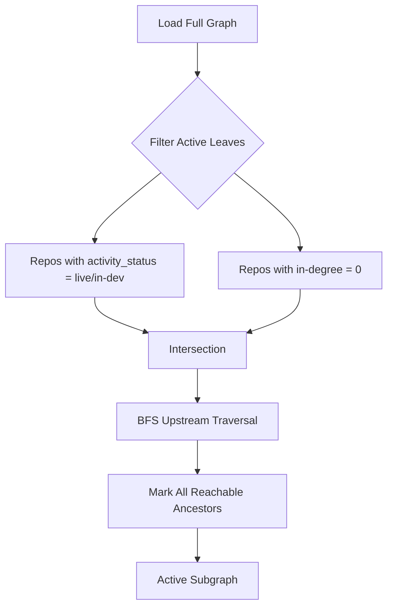
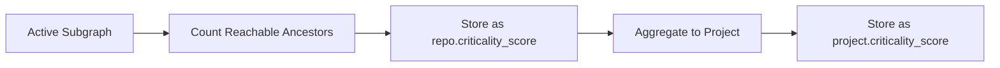
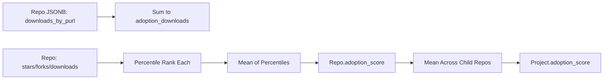

# Metric Computation

## Overview

The metric computation layer derives objective scores from the dependency graph and contributor data
to support funding decisions and public transparency. Three core metrics are operational:

- **Criticality score** — transitive active dependent count (how many projects depend on this)
- **Pony factor** — contributor concentration risk (minimum contributors responsible for ≥50% of
  commits)
- **Adoption score** — composite of downloads, stars, and forks

All metrics are computed at repo level and aggregated to project level. Computations run through
scheduled batch jobs: criticality and adoption materialize together during the weekly bootstrap
metrics job, while pony factor materializes separately during the gitlog workflow (every three days).
Results are materialized to database tables for fast API queries.

**Current performance**:

- Criticality (bootstrap): <60 seconds for 8,721 nodes
- Adoption (bootstrap): <10 seconds
- Pony factor (gitlog): <10 seconds

The system prioritizes full recomputation over incremental updates — batch performance is fast enough
that incremental logic would add complexity without meaningful benefit.

## Active Subgraph Projection

Active subgraph projection identifies the "live" portion of the ecosystem — repos that support at
least one active project. This filters out discontinued branches and ensures criticality scores
reflect current health rather than historical dependencies.

**Implementation**:

- Start from all **repo** vertices where `project.activity_status IN ('live', 'in-dev')` and
  `in-degree == 0` in the repo-level dependency graph (true leaves: repos with no dependents).
- Traverse upstream along "depends-on" edges (outgoing from dependents to dependencies).
- Mark all reached ancestors as part of the active ecosystem.
- Result: Subgraph containing only repo nodes with paths from active leaves.

Repo-level activity status is derived from the parent project's status (see
[Activity Status Update Logic](storage.md#activity-status-update-logic) in Storage). Both `live` and
`in-dev` repos are treated as active for subgraph projection.

## Operational Metrics

### Criticality Score

Criticality measures dependency pressure — how many active projects would be affected if this project
became unavailable. The score is computed as the count of active repos with a transitive dependency
path to the target repo.

**Computation workflow**:

1. Project active subgraph (repos from `live` and `in-dev` projects only)
2. For each repo, count ancestors in the reversed active subgraph (repos that depend on it,
   transitively)
3. Materialize as `criticality_score` on `repos` table
4. Aggregate to project level by summing criticality scores of all child repos
5. Store as `projects.criticality_score`

### Pony Factor

Pony factor measures contributor concentration risk — the minimum number of contributors responsible
for at least 50% of commits. Lower values indicate higher risk (e.g., pony factor = 1 means a single
contributor controls half the codebase).

**Computation workflow**:

**Repo-level calculation**:

- Extract commit counts from `contributed_to` edges over a rolling time window (typically 12-24
  months)
- Sort contributors descending by commit count
- Cumulative sum until reaching ≥50% of total commits
- Store the count as `Repo.pony_factor`

**Project-level aggregation**:

- Pool unique contributors across all project repos (deduplicated by `Contributor.email_hash`)
- Compute pony factor on the deduplicated contributor set
- This approach avoids artificially inflating the factor by counting the same contributor multiple
  times

Projects with single-contributor repos are flagged prominently in the dashboard as concentration
risks.

**v0 scope**: Basic pony factor only.

### Adoption Score

Adoption score aggregates off-chain usage signals to measure project visibility and community
engagement. Three signals are tracked:

- **Downloads** — Registry package downloads over the last 30 days
- **Stars** — GitHub stars (persistent interest marker)
- **Forks** — GitHub forks (indicator of users who also contribute)

**Repo-level computation**:

1. Aggregate per-PURL downloads from `repo_metadata` JSONB into scalar `adoption_downloads` column
2. Independently convert stars, forks, and downloads to percentile ranks (0-100) across all ecosystem
   repos
3. Compute composite score as mean of available signal percentiles (repos with NULL signals excluded
   from that signal's percentile pool)
4. Store as `Repo.adoption_score`

**Project-level aggregation**:

- Compute mean of child repo composite scores
- Store as `Project.adoption_score`
- Projects with no repos having signals are set to NULL

**v0 scope**: Simple percentile normalization only. Weighting formula and outlier handling deferred
pending operational data.

## Materialization and Performance

All computed metrics are materialized to database tables for fast API queries:

| Metric            | Repo Column               | Project Column               | Update Trigger        |
| ----------------- | ------------------------- | ---------------------------- | --------------------- |
| Criticality Score | `repos.criticality_score` | `projects.criticality_score` | Bootstrap metrics job |
| Pony Factor       | `repos.pony_factor`       | `projects.pony_factor`       | Gitlog workflow       |
| Adoption Score    | `repos.adoption_score`    | `projects.adoption_score`    | Bootstrap metrics job |

**Performance characteristics**:

- **Criticality** (weekly bootstrap): <60 seconds for 8,721 nodes across 611 projects
- **Adoption** (weekly bootstrap): <10 seconds
- **Pony factor** (gitlog workflow): <10 seconds
- **Memory footprint**: Entire graph fits in memory (~100K edges), enabling fast NetworkX operations

Incremental single-SBOM updates are not implemented — batch performance is sufficient, and avoiding
incremental logic reduces complexity.

## Future Enhancements

Near-term improvements under consideration include:

- **Extended contributor statistics** — Commit distribution (with diversity and concentration
  metrics), author tenure (comparable to Scientific Python devstats)
- **On-chain usage signals** — Soroban contract invocations, cross-contract calls, transaction volume
  (pending data availability)
- **Security and quality indicators** — Audit status, CVE response time, test coverage (requires
  additional ingestion pipelines)

These enhancements will build on the current foundation without disrupting existing metric
calculations. Specific priorities will be shaped by community feedback and observed dashboard usage
patterns.
