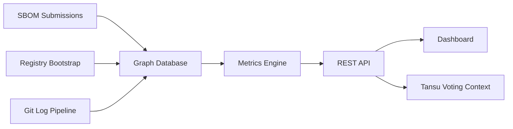

# Overview & Goals

## Purpose

PG Atlas is the objective, transparent metrics backbone for the SCF Public Goods Maintenance program.
Its primary role is to shift public goods funding decisions from noisy, subjective signals to
verifiable, data-driven insights by quantifying **adoption**, **criticality**, **reliability**,
**security/quality**, and **decentralization** (risk) across open-source tools, libraries, explorers,
RPC infrastructure, SDKs, and other foundational components in the Stellar/Soroban ecosystem.

By providing a live dependency graph, transitive impact scoring, pony factor analysis, and an active
subgraph projection, PG Atlas directly powers the **Metric Gate** in the proposed funding decision
stack (target ~50% weight in allocation formulas) and supplies off-chain context for NQG-weighted
community voting in the Tansu-based Public Goods DAO pilot.

## Why PG Atlas Matters

- **Reduces systemic risk**: Early detection of pony factor issues, low-usage tools, or concentration
  risks prevents cascading failures (e.g., Okashi/Mercury-style breakdowns).
- **Improves funding efficiency**: Replaces "expectation everyone gets funded" inertia with
  merit-based baselines, minimizing over-funding of low-impact tools while rewarding proven,
  widely-used infrastructure.
- **Enhances legitimacy & decentralization**: Public, reproducible metrics build voter/expert trust,
  attract serious maintainers, and position Stellar's PG program as best-in-class among mid-tier L1s
  (more transparent than Gitcoin QF, more predictable than Polkadot treasury referenda, as
  impact-aligned as Optimism RetroPGF but with NQG sybil resistance).
- **Accelerates ecosystem growth**: Clear visibility into dependencies encourages reuse over
  duplication, lowers developer friction, and signals priorities for new tooling.

If under-delivered: We remain stuck with quarterly manual reviews, noisy signals, and persistent pony
factor risks — stalling the 2026 outcomes (coverage/reliability, risk reduction, signal quality).

## Current System Snapshot

PG Atlas is **operational and supporting the SCF Public Goods Award process**. The system has evolved
from initial bootstrapping to a production service that provides transparent metrics for funding
decisions.

**Live now**:

- **Dependency graph**: 8,721 nodes across 611 projects, built from SBOM submissions and automated
  registry crawling (npm, crates.io, PyPI, pub.dev, Packagist)
- **Metrics pipeline**: Criticality scores (transitive active dependent count), pony factor
  (contributor concentration risk), and adoption scores (downloads + stars + forks) materialized and
  updated automatically
- **Public REST API**: [api.pgatlas.xyz/docs](https://api.pgatlas.xyz/docs) — rate-limited, sortable,
  filterable endpoints for projects, repos, scores, and graph exports
- **Public dashboard**: [pgatlas.xyz](https://pgatlas.xyz) — searchable leaderboards, project detail
  pages with score breakdowns and dependency visualization
- **Scheduled operations**: Weekly bootstrap (full ecosystem refresh), periodic git log processing
  (dormancy-based), hourly SBOM queue processing
- **On-chain governance integration**: Soulbound SCF Pilot credentials with NQG-weighted voting in
  Tansu, visible at [scf.pgatlas.xyz](https://scf.pgatlas.xyz)
- **Community feedback**: Active via Discord #verified-panel and Office Hours

Explore the
[backend changelog](https://github.com/SCF-Public-Goods-Maintenance/pg-atlas-backend/blob/main/CHANGELOG.md)
for detailed release history, or check current
[workflow runs](https://github.com/SCF-Public-Goods-Maintenance/pg-atlas-backend/actions) for
operational status.

## What's Next

The initial operational system establishes a foundation for ongoing improvements. Near-term focus
areas include:

**Data quality enhancements**:

- Refining project-to-repo mapping accuracy across the ecosystem
- Improving fork handling (ignoring inactive forks while preserving important within-ecosystem forks)
- Experimenting with dependency and contributor graph clustering to better detect project and
  ecosystem boundaries

**Operational hardening**:

- Enhanced error tracking and alerting (Sentry integration)
- Additional observability beyond current workflow logs and automated summaries
- Continued refinement of metric coverage for projects without published packages

These priorities are preliminary, pending the Q2 award round retrospective. The full roadmap will be
shaped by community feedback and observed usage patterns. Open issues in the
[backend](https://github.com/SCF-Public-Goods-Maintenance/pg-atlas-backend/issues) and
[frontend](https://github.com/SCF-Public-Goods-Maintenance/pg-atlas-frontend/issues) repositories
track specific enhancements.

## Architecture Overview

The system operates through three parallel ingestion streams that feed a unified dependency graph
stored in PostgreSQL. Metrics are materialized through scheduled batch jobs and event-driven updates,
then exposed via a public API that serves both the dashboard and Tansu governance integration.

## Core Architecture Principles

**In scope**:

- Shadow graph bootstrapping from public registries (npm, crates.io, PyPI, Go proxy via APIs or Open
  Source Observer).
- SBOM ingestion via GitHub Action (verification layer).
- **Two-level data model**: `Project` (funding/scoring unit, DAOIP-5 URIs) → `Repo` (1-to-many,
  ingestion unit). Separate `ExternalRepo` table for out-of-ecosystem dependencies. All ingestion
  writes at repo level; project-level metrics derived by aggregation. See [Storage](storage.md) for
  schema details.
- Directed `depends_on` graph at repo resolution, with project-level view derived by collapsing repo
  edges.
- **Activity status**: 4-value enum (`live`, `in-dev`, `discontinued`, `non-responsive`) on `Project`
  — sourced from SCF Impact Survey (yearly baseline) with higher-resolution triangulation from
  OpenGrants completion % and repo `latest_commit_date`. See
  [Activity Status Update Logic](storage.md#activity-status-update-logic).
- Active subgraph projection via upstream propagation from active leaves.
- Core metrics: transitive dependent count, pony factor (git log parsing), basic off-chain adoption —
  all computed at repo level, aggregated to project level. PG Score composite formula deferred.
- Decoupled backend: PostgreSQL + NetworkX (decided in
  [issue #2](https://github.com/SCF-Public-Goods-Maintenance/scf-public-goods-maintenance.github.io/issues/2)).
- FastAPI layer with OpenAPI docs and
  [TypeScript SDK](https://github.com/SCF-Public-Goods-Maintenance/pg-atlas-ts-sdk) generated from
  spec.
- Public dashboard built with React, consuming the REST API.

For API stability and versioning strategy, see the
[API versioning documentation](https://github.com/SCF-Public-Goods-Maintenance/pg-atlas-backend/blob/main/pg_atlas/routers/api-versioning.md)
in the backend repository.

**Deferred for future versions**:

- Versioned package modeling (blast radius per release).
- Native property graph DB deployment — PostgreSQL + NetworkX is the v0 choice; graph DB options
  documented in [Graph Scaling](graph-scaling.md) for future evaluation.
- Advanced Sybil-resistant usage signals.
- Dependency edges based on cross-contract calls (e.g. Stellar Registry integration) and HTTP API
  dependencies (e.g. which repos pull data from Stellar Expert?).
- Unified on-chain metrics that would answer e.g. which public goods enable protocol _ABC_ to manage
  _X_ TVL for _Y_ MAU?
- PG Score composite weighting formula (deferred until experience from first rounds).
- Implementation of the "Metric Gate" that can be incorporated into Public Goods Award governance.

## Design Decisions and Trade-offs

**PostgreSQL + NetworkX over native graph databases**: The current scale (8,721 nodes, ~100K edges)
fits comfortably in memory, allowing sub-second metric materialization. This choice prioritized rapid
development and operational simplicity over theoretical graph query performance. Migration paths to
property graph databases are documented in [Graph Scaling](graph-scaling.md) if scale requirements
change significantly.

**Shadow graph bootstrapping**: Automated registry crawling reduces the burden on project teams while
building initial coverage. SBOM submissions provide verification and fill gaps where registry
metadata is incomplete. This hybrid approach balances completeness with maintainer convenience.

**Repo-level ingestion, project-level funding**: All dependency data flows in at repository
granularity (matching how packages and SBOMs are structured), but funding decisions and public
visibility operate at the project level. This separation acknowledges that projects often span
multiple repositories while preserving accurate dependency tracking.

**Rate-limited public API**: The API is fully public (no authentication for reads) to maximize
transparency, with rate limiting (100 requests/minute per IP) to prevent abuse. Ingest endpoints use
GitHub OIDC authentication to verify submission provenance. See [Security](security.md) for details
