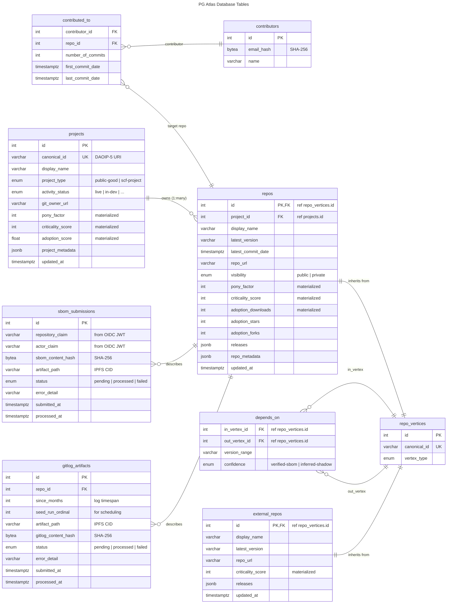

# Storage

## Overview

The storage layer persists the dependency graph, node/edge metadata, contributor statistics, and raw
ingested artifacts. The system uses PostgreSQL as the primary database with NetworkX for graph
analytics, supporting both incremental updates (SBOM submissions, git log refreshes) and periodic
batch operations (weekly bootstrap, metric materialization).

**Current architecture**:

- **PostgreSQL 18** — Hosted on DigitalOcean Managed Database with automated snapshots and
  point-in-time recovery
- **Graph data model** — Designed as a property graph with tables for vertices (`projects`, `repos`,
  `external_repos`, `contributors`) and edges (`depends_on`, `contributed_to`)
- **NetworkX integration** — Graph analytics (criticality BFS, metric materialization) performed
  in-memory on the loaded graph
- **Artifact storage** — Raw SBOM and gitlog extract files stored on Filebase S3 with IPFS CIDs
  recorded in the database for content-addressable auditability
- **Migration management** — Alembic migrations tracked in the
  [backend repository](https://github.com/SCF-Public-Goods-Maintenance/pg-atlas-backend/tree/main/pg_atlas/migrations)

The architecture prioritizes operational simplicity and rapid iteration while maintaining a clear
migration path to native graph databases if scale requirements change significantly (see
[Graph Scaling](graph-scaling.md)).

### Why PostgreSQL + NetworkX?

The working group chose PostgreSQL + NetworkX for v0 based on:

1. **Team expertise**: Everyone knows PostgreSQL. The team has direct connections to NetworkX
   maintainers (Scientific Python ecosystem).
2. **Speed to ship**: FastAPI + SQLAlchemy + PostgreSQL is a well-trodden path. We can have a working
   prototype in days, not weeks — critical for the Q2 v0 deadline.
3. **Scale appropriateness**: At 5–10K nodes and 50–100K edges, the entire graph fits in memory.
   Fetching full tables from the DB takes longer than representing them in NetworkX. We're at a scale
   where developer velocity matters more than graph DB optimizations.
4. **Operational simplicity**: PostgreSQL is a single process with simple backups. No JVM, no Gremlin
   Server, no schema management through separate console. This aligns with our <$100/month target and
   no dedicated DevOps constraint.
5. **Natural home for tabular data**: Pony factor stats, contributor logs, SBOM metadata, audit
   trails, API rate-limit state — all naturally live in PostgreSQL tables.
6. **Migration path preserved**: If we outgrow in-memory NetworkX, we can export to TinkerPop with a
   bulk loader. The data model is designed with TinkerPop compatibility in mind.

**Trade-offs accepted**:

- **Intentional technical debt**: If the long-term answer is TinkerPop (and the architecture suggests
  it might be), PostgreSQL + NetworkX is a temporary scaffold. Every query in SQL + NetworkX may need
  to be rewritten in Gremlin later. We're betting the speed-to-ship benefit justifies this future
  cost.
- **Dual representation**: The graph lives in PostgreSQL (source of truth) and NetworkX
  (computation). At this scale, we can reload on every change or build simple invalidation.
- **Shallow team NetworkX experience**: Collective experience of the core team is measured in months,
  not years. However, we have recruited a NetworkX expert and we also have direct access to NetworkX
  maintainers for guidance.

## Data Model

The schema is implemented as a property graph using PostgreSQL tables, designed for efficient
NetworkX integration and future portability to native graph databases. The following ERD shows the
core entities (excluding Procrastinate task queue tables):



The schema enforces referential integrity through foreign keys while maintaining flexibility for
future graph database migration.

### Core Modeling Decision: Project vs. Repo

A common assumption is 1 project = 1 repo/package. In practice, many projects span multiple
repositories (e.g., an SDK with separate client, server, and CLI repos). All ingestion (SBOMs, git
logs, registry crawls) happens at the **repo** resolution, but funding decisions and public goods
scoring happen at the **project** level.

We model this as two separate vertex types with a **one-to-many** relationship: one `Project` has
many `Repo` vertices. In PostgreSQL, this is enforced via a foreign key on the `repos` table pointing
to `projects`, rather than a separate association table — enforcing the 1-to-many constraint at the
schema level.

**External upstream repos** (dependencies outside the Stellar ecosystem that we track for blast
radius analysis) are stored in a separate `ExternalRepo` table. We don't maintain project-level data
for these — they exist only as dependency targets for graph analysis.

The dependency graph operates at two levels:

- **Repo-level `depends_on` edges**: The raw truth from SBOMs and registry crawls. All ingestion
  writes here.
- **Project-level dependencies**: Derived by aggregating repo-level edges. In the dashboard, we show
  project-to-project dependencies by default, with the option to drill down to repo-level detail.

### Vertex Types

#### `Project`

Represents a funded project or recognized public good in the Stellar/Soroban ecosystem. Sourced
primarily from OpenGrants.

**Columns** (vertex properties):

- `canonical_id` (unique key: DAOIP-5 URI, e.g. `daoip-5:stellar:project:stellarcarbon`).
- `display_name`.
- `type` (enum: `public-good`, `scf-project`).
- `activity_status` (enum: `live`, `in-dev`, `discontinued`, `non-responsive`).
- `git_org_url` (str: GitHub/GitLab organization URL, for discovery and linking).
- `pony_factor` (int: materialized, aggregated across all project repos).
- `criticality_score` (int: materialized, sum of all project repo criticality scores).
- `adoption_score` (float: materialized, composite of repo-level adoption signals).
- `metadata` (JSONB: anything we want to show but not traverse/query). In Python the attribute is
  `project_metadata` to avoid the SQLAlchemy `metadata` name reservation.
- `updated_at` (timestamp).

#### `Repo`

Represents a single git repository or published package within the ecosystem.

**Columns** (vertex properties):

- `canonical_id` (unique key: `ecosystem:package` or `github:org/repo`).
- `display_name`.
- `project_id` (foreign key → `Project`; enforces 1-to-many).
- `latest_version` (str: git hash/tag or published version; **required**). SBOM ingestion should
  always supply this; it is the canonical version identifier for graph snapshot diffs.
- `latest_commit_date` (timestamp: from git log, used for activity triangulation).
- `repo_url` (str: the ingestion source for git contributor stats).
- `visibility` (enum: `public`, `private`)
- `pony_factor` (int: materialized, computed from this repo's contributor stats).
- `criticality_score` (int: materialized, transitive active dependent count for this repo).
- `releases` (JSONB array: `[{"version": "...", "release_date": "..."}]`).
- `adoption_downloads` (int: registry downloads last 30 days, from npm/crates/PyPI).
- `adoption_stars` (int: GitHub stars).
- `adoption_forks` (int: GitHub forks).
- `metadata` (JSONB, including code license from dependent SBOMs or GitHub API). In Python the
  attribute is `repo_metadata` to avoid the SQLAlchemy `metadata` name reservation.
- `updated_at` (timestamp).

#### `ExternalRepo`

Represents an upstream dependency outside the Stellar/Soroban ecosystem. Tracked for blast radius
analysis only — no project-level data maintained. We don't need to model dependencies between
external repos. SBOM ingestion from Project repos will give us either direct or transitive
dependencies, depending on the manifest format. Within-ecosystem criticality is tracked to show
interesting targets for blast radius analysis.

**Columns**:

- `canonical_id` (unique key: `ecosystem:package`, e.g. `npm:express`).
- `display_name`.
- `latest_version` (str: from registry crawl; **required**).
- `repo_url` (str: future extension point, nice to have).
- `criticality_score` (int: materialized, transitive active dependent count for this repo).
- `releases` (JSONB array: `[{"version": "...", "release_date": "..."}]`).
- `updated_at` (timestamp).

#### `Contributor`

**Columns** (vertex properties):

- `email_hash` (SHA-256 digest of the normalized author email, stored as 32-byte BYTEA / 64-char hex
  string via `HexBinary`; used for reconciliation across repos).
- `name` (commit author).

### Edge Types

#### `depends_on`

- Directed: dependent repo → dependency repo (pointing "toward roots").
- Source vertex: `Repo` or `ExternalRepo` (any `RepoVertex`).
- Target vertex: `Repo` or `ExternalRepo` (any `RepoVertex`).
- Stored in the `depends_on` table with **integer foreign keys** to `repo_vertices.id`, which
  provides full referential integrity while allowing a single FK column to reference either subtype.
- Properties:
  - `version_range` (str).
  - `confidence` (enum: `verified-sbom`, `inferred-shadow`).

#### `contributed_to`

- Directed: `Contributor` → `Repo`.
- Properties:
  - `number_of_commits` (int: from `git shortlog -sne`).
  - `first_commit_date` (timestamptz, UTC; **required**).
  - `last_commit_date` (timestamptz, UTC; **required**).

### Activity Status Update Logic

The `activity_status` of projects follows a defined update cascade with multiple data sources at
different temporal resolutions:

**Primary source**: SCF Impact Survey (yearly). Provides baseline classification:

- Survey response → `live`, `in-dev`, or `discontinued`.
- No response for a project loaded from OpenGrants → `non-responsive`.

**Higher-resolution updates** (from OpenGrants completion % and repo `latest_commit_date`):

- `in-dev` → `live`: When OpenGrants completion percentage reaches 100%.
- `discontinued` → `live`: Upon new git commits detected in any associated repo.
- `discontinued` → `in-dev`: New commit, when OpenGrants completion percentage < 100.
- `non-responsive` → `live`: Upon new git commits detected in any associated repo.
- `non-responsive` → `in-dev`: New commit, when OpenGrants completion percentage < 100.

**Intentionally not automated**: We **do not** mark `live` or `in-dev` projects as `discontinued`
based on a lack of git activity. Stable, mature tools may have long periods without commits. We wait
for the next survey cycle to re-classify downward.

The precise status update logic is not yet finalized — we want to test it once we can load data from
all sources (survey, OpenGrants, git logs).

### SBOM Submission Audit Table

Every SBOM ingest attempt is recorded in `sbom_submissions`:

| Column              | Type                | Notes                                |
| ------------------- | ------------------- | ------------------------------------ |
| `id`                | serial PK           |                                      |
| `repository_claim`  | varchar(256)        | `repository` field from the OIDC JWT |
| `actor_claim`       | varchar(128)        | `actor` field from the OIDC JWT      |
| `sbom_content_hash` | bytea (hex in code) | SHA-256 of raw SBOM bytes            |
| `artifact_path`     | varchar(1024)       | IPFS CID in artifact store           |
| `status`            | enum                | `pending` → `processed` or `failed`  |
| `error_detail`      | varchar(4096)       | Error message on failure             |
| `submitted_at`      | timestamptz         | Server-default `now()`               |
| `processed_at`      | timestamptz         | Null until processing completes      |

**Deduplication**: Identical SBOMs (by content hash) are acknowledged but not reprocessed if already
successfully processed for the given repository.

**Artifact retrieval**: The API never exposes raw SBOM bytes directly via graph endpoints. Audit
endpoints (`/ingest/sbom/{submission_id}`) can retrieve the full artifact for inspection.

### Git Log Audit Table

Every git log processing attempt is recorded in `gitlog_artifacts`:

| Column                | Type                | Notes                                                 |
| --------------------- | ------------------- | ----------------------------------------------------- |
| `id`                  | serial PK           |                                                       |
| `repo_id`             | int FK              | References `repos.id`                                 |
| `since_months`        | int                 | Log timespan (e.g., 12 for 12-month history)          |
| `seed_run_ordinal`    | int                 | For dormancy-based scheduling (higher = more dormant) |
| `artifact_path`       | varchar(1024)       | IPFS CID in artifact store                            |
| `gitlog_content_hash` | bytea (hex in code) | SHA-256 of raw git log bytes                          |
| `status`              | enum                | `pending` → `processed` or `failed`                   |
| `error_detail`        | varchar(4096)       | Error message on failure                              |
| `submitted_at`        | timestamptz         | When the log extraction was queued                    |
| `processed_at`        | timestamptz         | Null until processing completes                       |

**Scheduling context**: `seed_run_ordinal` tracks dormancy for the gitlog queue scheduler —
repositories with lower ordinals (stale data) are prioritized for refresh.

**Artifact retrieval**: The `/gitlog/{artifact_id}` endpoint can retrieve the full raw git log for
inspection.

## Schema Design Patterns

We enforce data modeling discipline to ensure clean handoff between PostgreSQL storage and NetworkX
analysis. The key principle: **model everything as a property graph in tables**, avoiding patterns
that work in SQL but create awkward graph structures.

### Graph Modeling Patterns

**Vertex types** (e.g., `Project`, `Repo`, `ExternalRepo`, `Contributor`):

- Columns contain mostly literal data.
- The `Repo.project_id` foreign key enforces the 1-to-many Project→Repo relationship. During graph
  construction, this is either joined to attach project metadata to repo nodes, or used to build a
  `part_of` edge in the NetworkX graph.

**`RepoVertex` Joined Table Inheritance (JTI)**:

Both `Repo` and `ExternalRepo` inherit from a common `RepoVertex` base class backed by the
`repo_vertices` table. This table holds the shared identity columns (`id`, `canonical_id`,
`vertex_type` discriminator). Concrete subtypes store their own columns in `repos` and
`external_repos` tables, joined by primary key.

The motivation: edge tables (`depends_on`) carry a single FK column pointing to `repo_vertices.id`,
which gives full referential integrity — a constraint on `in_vertex_id`/`out_vertex_id` correctly
enforces that both endpoints must be known vertices, regardless of subtype. This is exactly the
property-graph "vertex registry" pattern.

```txt
repo_vertices (id PK, canonical_id, vertex_type)
     │ ← FK
repos (id FK ref repo_vertices.id, display_name, project_id FK, visibility, ...)
external_repos (id FK ref repo_vertices.id, display_name, ...)
depends_on (in_vertex_id FK ref repo_vertices.id, out_vertex_id FK ref repo_vertices.id, ...)
```

**Edge types** (e.g., `depends_on`, `contributed_to`):

- Use **integer FK columns** (`in_vertex_id`, `out_vertex_id`) referencing `repo_vertices.id` rather
  than string identifiers. This provides referential integrity and enables efficient JOINs.
- Additional columns store literal data (edge properties).
- Multi-valued edge properties use JSONB if needed.
- SQLAlchemy association tables or explicit edge models.

**Implementation conventions**:

- All timestamps are `DateTime(timezone=True)` (UTC everywhere — no localized datetimes in the
  schema). Python code uses UTC-aware `datetime.datetime` objects.
- `sbom_submissions.sbom_content_hash` is stored as 32-byte BYTEA via a `HexBinary` `TypeDecorator`
  that transparently converts between 64-char hex strings in Python code and compact binary storage
  in PostgreSQL.

This approach lets us hand analysis off to NetworkX early, rather than doing traversals in PostgreSQL
to construct the graph. We can use existing glue like `nx.from_pandas_edgelist()` or build minimal
custom loaders.

### Classic Traversal Pitfalls to Avoid

If we do need SQL-based traversals (e.g., during SBOM ingestion validation), we'll use standard
mitigations:

- **Transitive Closure Explosion** (duplicate path processing) → Use `DISTINCT` and/or `UNION` at
  each traversal level.
- **Join Re-evaluations** (when joining edge to vertex tables) → Pre-filter edges, then traverse; or
  complete traversal then join (late materialization).
- **Index Fragmentation on UUIDs** → Use sequential integers as primary keys; UUIDs as secondary
  identifiers if needed.

### Deployment Considerations

The database runs on **DigitalOcean Managed PostgreSQL** with automated operational features:

- **Automated snapshots** — Daily backups with configurable retention
- **Point-in-time recovery (PITR)** — Restore to any point within the retention window
- **Connection pooling** — Managed by PG Atlas and Procrastinate

The backend uses SQLAlchemy with `asyncpg` for async FastAPI support. Schema migrations are managed
with Alembic in
[`pg_atlas/migrations/`](https://github.com/SCF-Public-Goods-Maintenance/pg-atlas-backend/tree/main/pg_atlas/migrations).
The initial migration creates all core tables and PostgreSQL enum types.
