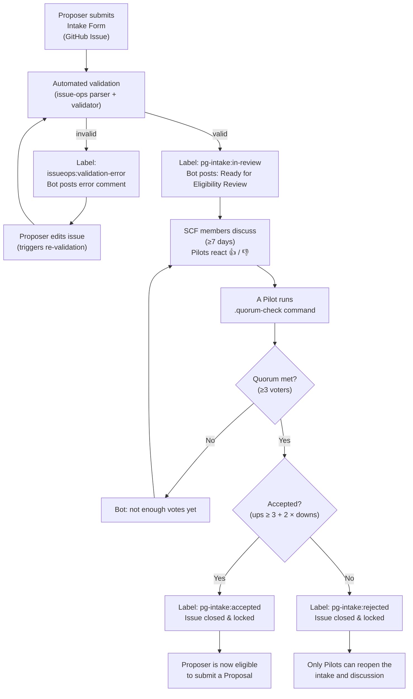
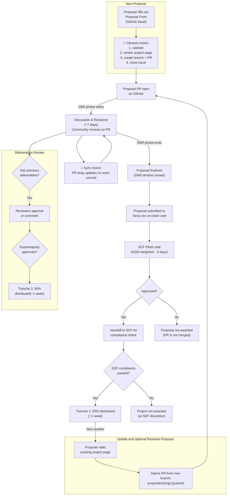

# Proposer Instructions

The SCF Public Goods Award provides quarterly funding for maintenance, security, and incremental
evolution of open-source public goods in the Stellar ecosystem. This page walks proposers through the
full lifecycle — from intake eligibility through proposal submission, community review, on-chain
voting, award distribution, and renewal.

## Intake Process (Rolling Admissions)

The intake process determines whether a project is eligible to submit a formal proposal. Intake is
**always open** — there is no deadline. Projects can submit an intake form at any time, and approved
projects can submit a proposal in the next available quarterly round.

### How It Works

1. **Submit the Intake Form.** Open a
   [new Intake Form issue](https://github.com/SCF-Public-Goods-Maintenance/scf-public-goods-maintenance.github.io/issues/new?template=pg-award-intake-form.yml){:target="⚡"}
   in this repository.
2. **Automated validation.** The form is validated automatically. If there are errors, the bot will
   flag them and you can edit your issue to fix them.
3. **Eligibility discussion.** Once validated, your intake enters the `pg-intake:in-review` state.
   SCF members — especially Pilots — discuss your project in the issue thread. This period lasts a
   minimum of 7 days. Pilots signal their position by reacting with 👍 or 👎.
4. **Quorum check.** A Pilot runs the `.quorum-check` command. The bot counts pilot reactions:
   - Minimum 3 voters required.
   - Acceptance formula: `ups ≥ 3 + 2 × downs` (each downvote raises the bar by 2 upvotes).
5. **Decision.** The issue is labeled `pg-intake:accepted` or `pg-intake:rejected`, then closed and
   locked. If rejected, only Pilots can reopen the intake and discussion.

Once accepted, you are eligible to submit a proposal in the next quarterly round.

## Proposal Process — Quarterly Timeline

**Eligibility:** Only projects approved through intake or through previous Award participation may
submit the proposal form. Ineligible use of the form is publicly visible.

| Phase                             | Description                                                                                                                                                                                                                                                                                                                                                                             | Duration               |
| --------------------------------- | --------------------------------------------------------------------------------------------------------------------------------------------------------------------------------------------------------------------------------------------------------------------------------------------------------------------------------------------------------------------------------------- | ---------------------- |
| 1️⃣ Proposal Submission            | Proposer fills out the [Proposal Form](https://github.com/SCF-Public-Goods-Maintenance/scf-public-goods-maintenance.github.io/issues/new?template=pg-award-proposal-form.yml){:target="⚡"} (GitHub Issue). Automation validates the submission, generates a project page, and creates a Pull Request. The issue is closed with a link to the PR. For renewals, see [below](#renewals). | Quarterly window       |
| 2️⃣ Discussion & Revisions (D&R)   | Community reviews the proposal PR on GitHub. Proposer edits the project page directly on the PR branch; the PR description auto-syncs on every commit. Previous deliverables are also reviewed during this phase. Early entrants have more time for revisions; late entrants have less.                                                                                                 | ~7 days                |
| 3️⃣ On-chain Submission            | At the close of the D&R window, revised proposals are submitted to [Tansu](https://tansu.dev){:target="⚡"} for on-chain voting.                                                                                                                                                                                                                                                        | Within 2 business days |
| 4️⃣ On-chain Vote                  | SCF Pilots vote on proposals using NQG-weighted scores on Tansu.                                                                                                                                                                                                                                                                                                                        | ~3 days                |
| 5️⃣ SDF Compliance & Payout Setup  | After community approval, SDF performs a final compliance check. At SDF's discretion, if a community-approved proposal does not meet Award eligibility, the project is not awarded.                                                                                                                                                                                                     | ~1 week                |
| 6️⃣ Award Distribution — Tranche 1 | First 50% of the award is distributed after approval and payment setup.                                                                                                                                                                                                                                                                                                                 | ~1 week                |
| 7️⃣ Award Distribution — Tranche 2 | Second 50% is distributed after reviewers approve previous deliverables (supermajority required).                                                                                                                                                                                                                                                                                       | Next quarter           |

## Filling Out the Proposal Form

The
[Proposal Form](https://github.com/SCF-Public-Goods-Maintenance/scf-public-goods-maintenance.github.io/issues/new?template=pg-award-proposal-form.yml){:target="⚡"}
is mostly self-explanatory. A few things to keep in mind:

- **Project Name** is used to generate the URL slug for your project page (e.g., "StellarExpert
  Explorer" → `stellarexpert-explorer`). Choose a clear, recognizable name.
- **PG Intake Form** — link to your approved intake issue. If you submitted through Airtable during
  the soft-launch period, write "soft-launch".
- **Budget Requested** — up to $50,000 in XLM per quarter. Your budget should be reasonable relative
  to your retroactive impact and planned deliverables.
- **Legal Acknowledgements** — you must agree to the
  [Legal Acknowledgements](https://stellar.gitbook.io/scf-handbook/supporting-programs/public-goods-award/legal-acknowledgements){:target="⚡"}
  provided by SDF. This is required to proceed.

**Tip:** Links in the form open in your current browser tab by default. Draft your answers in a
separate file first, or copy them as a backup before submitting.

## Discussion & Revisions (D&R)

After you submit the Proposal Form, automation creates a Pull Request containing your project page
and closes the issue with a link to the PR. From that point on, **the PR is your proposal**.

### How to Make Revisions

1. Go to your PR and navigate to the "Files changed" tab.
2. Click the pencil icon (Edit) on your project page file.
3. Make your changes and commit them directly to the PR branch.

Every commit automatically updates the PR description to stay in sync with your project page. You can
also clone the branch locally and push changes using git.

### Review Process

- Community members and reviewers (SCF Pilots) leave feedback directly on the PR using comments and
  GitHub's **Suggest Changes** feature.
- When you accept a suggested change, it counts as a commit, so the PR description updates
  automatically.
- All formal discussion and feedback happens on the PR. We encourage you to also post a thread in
  **#projects** on the [Stellar Developers Discord](https://discord.gg/stellardev){:target="⚡"} for
  broader informal discussion, which can continue outside of the Public Goods Award quarterly cycle.

## Renewals

Projects that received a previous Award **do not fill out the Proposal Form again**. Instead, you
update your existing project page directly:

1. Navigate to your project page in the
   [`docs/projects/`](https://github.com/SCF-Public-Goods-Maintenance/scf-public-goods-maintenance.github.io/tree/main/docs/projects){:target="⚡"}
   directory on the `main` branch.
2. Click the **Edit** (pencil) icon on your project page.
3. Update the relevant sections: new retroactive impact, deliverable evidence, next-quarter goals,
   and updated budget.
4. Choose **"Create a new branch for this commit and start a pull request."**
5. Name your branch following the convention: `proposals/{slug}-{quarter}` (e.g.,
   `proposals/stellar-sdk-2026q3`).

Because the sync automation triggers on any PR that modifies files in `docs/projects/`, your PR
description will automatically populate with the content of your updated project page. The renewal PR
then goes through the same Discussion & Revisions → On-chain Vote → Payout cycle as new proposals.

## Access & Permissions

Proposers need to be added to the GitHub team corresponding to their SCF membership role. Those that
are not SCF Pilots are added to the `pg-maintainer` team to get the write permission needed to create
and edit PRs without forking.

If you do not have write access to this repository, contact an active SCF Pilot or SDF representative
to be added to the appropriate team before submitting your proposal.
